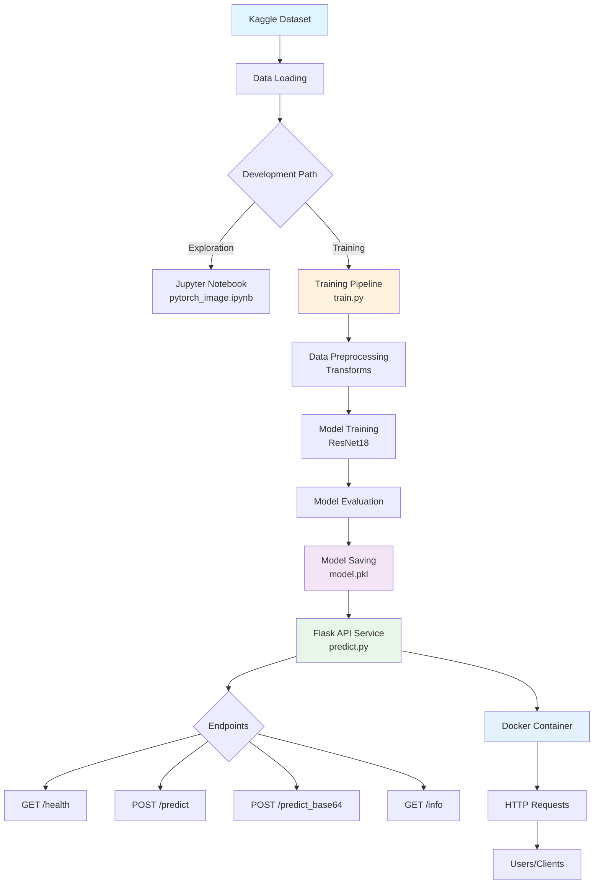

# PyTorch Image Classification with Pretrained Models

[](https://github.com/DaniloBlancoMotta/Pytorch_Image_Classification_Pretrained.ipynb/actions/workflows/ci.yml)
[](https://www.python.org/downloads/)
[](https://opensource.org/licenses/MIT)
[](https://github.com/psf/black)

## 📋 Descrição

Este projeto implementa classificação de imagens utilizando PyTorch e modelos pré-treinados. O foco é demonstrar como utilizar transfer learning para classificação de lesões em folhas de feijão.

## 🎯 Objetivo

O projeto tem como objetivo classificar imagens de folhas de feijão em três categorias:
- **Angular Leaf Spot** (Mancha Angular)
- **Bean Rust** (Ferrugem)
- **Healthy** (Saudável)

## 🛠️ Tecnologias Utilizadas

- **Python 3.x**
- **PyTorch** - Framework de Deep Learning
- **torchvision** - Modelos pré-treinados e transformações
- **scikit-learn** - Pré-processamento de dados
- **Matplotlib** - Visualização
- **Pandas** - Manipulação de dados
- **PIL (Pillow)** - Processamento de imagens

## 📊 Dataset

O dataset utilizado é o **Bean Leaf Lesions Classification** disponível no Kaggle:
- Total de imagens: 1,167
- Classes: 3 (balanceadas)
- Divisão: 70% treino / 30% teste

## 🏛️ Arquitetura da Aplicação

### Diagrama Visual


### Fluxo de Dados



### Componentes Principais

| Componente | Arquivo | Descrição |
|------------|---------|-----------|
| 📊 **Data Source** | Kaggle | Dataset de lesões em folhas de feijão |
| 📓 **Notebook** | `pytorch_image.ipynb` | Análise exploratória e experimentação |
| 🎯 **Training** | `train.py` | Pipeline de treinamento do modelo |
| 💾 **Model** | `model.pkl` | Modelo treinado salvo |
| 🌐 **API Service** | `predict.py` | Serviço Flask para predições |
| 🐳 **Container** | `Dockerfile` | Containerização da aplicação |
| 🧪 **Tests** | `test_predict.py` | Testes unitários |

## 🏗️ Estrutura do Projeto

```
Image_classification/
│
├── pytorch_image.ipynb          # Notebook de exploração e análise
├── train.py                     # Script de treinamento
├── predict.py                   # Serviço API Flask
├── model.pkl                    # Modelo treinado
├── best_model.pkl              # Melhor modelo durante treinamento
│
├── README.md                    # Documentação
├── requirements.txt             # Dependências Python
├── LICENSE                      # Licença MIT
│
├── Dockerfile                   # Containerização
├── .dockerignore               # Arquivos ignorados no build
├── .gitignore                  # Arquivos ignorados no Git
│
└── data/                       # Diretório de dados
    ├── train.csv
    ├── val.csv
    └── images/
```

## 🚀 Como Usar

### Instalação

1. Clone o repositório:
```bash
git clone https://github.com/DaniloBlancoMotta/Pytorch_Image_Classification_Pretrained.ipynb.git
cd Pytorch_Image_Classification_Pretrained.ipynb
```

2. Instale as dependências:
```bash
pip install -r requirements.txt
```

### Treinamento do Modelo

Para treinar o modelo do zero:

```bash
python train.py
```

Isso irá:
- Carregar os dados do diretório `data/`
- Treinar um modelo ResNet18 pré-treinado
- Salvar o melhor modelo como `best_model.pkl`
- Salvar o modelo final como `model.pkl`
- Exibir métricas de performance

**Parâmetros de Treinamento:**
- Modelo: ResNet18 (pré-treinado)
- Batch Size: 32
- Épocas: 10
- Learning Rate: 0.001
- Otimizador: Adam

### Executando o Serviço de Predição

#### Opção 1: Localmente com Python

```bash
python predict.py
```

O serviço estará disponível em `http://localhost:9696`

#### Opção 2: Com Docker

```bash
# Build da imagem
docker build -t bean-classifier .

# Executar container
docker run -p 9696:9696 bean-classifier
```

### Testando a API

#### Health Check
```bash
curl http://localhost:9696/health
```

#### Fazer Predição (Upload de Imagem)
```bash
curl -X POST http://localhost:9696/predict \
  -F "file=@path/to/image.jpg"
```

#### Usando Python
```python
import requests

# Upload de arquivo
with open('image.jpg', 'rb') as f:
    files = {'file': f}
    response = requests.post('http://localhost:9696/predict', files=files)

print(response.json())
```

#### Resposta Esperada
```json
{
  "success": true,
  "prediction": {
    "prediction": 2,
    "class_name": "Healthy",
    "confidence": 0.95,
    "probabilities": {
      "0": 0.02,
      "1": 0.03,
      "2": 0.95
    }
  }
}
```

## 📝 Workflow do Notebook

1. **Inicialização e Download do Dataset**
   - Download do dataset do Kaggle usando `opendatasets`

2. **Imports**
   - Importação de bibliotecas necessárias
   - Configuração do dispositivo (GPU/CPU)

3. **Leitura dos Dados**
   - Carregamento dos CSVs de treino e validação
   - Concatenação dos dados

4. **Inspeção dos Dados**
   - Análise das classes
   - Distribuição dos dados

5. **Divisão dos Dados**
   - Split 70/30 para treino/teste

6. **Pré-processamento**
   - Criação do LabelEncoder
   - Definição de transformações (resize, normalização)

7. **Dataset Customizado**
   - Implementação de classe CustomImageDataset

8. **Visualização**
   - Exibição de amostras de imagens

9. **Treinamento do Modelo**
   - Utilização de modelos pré-treinados (Transfer Learning)

## 🔌 API Endpoints

O serviço Flask expõe os seguintes endpoints:

### `GET /`
Página inicial com informações do serviço

**Resposta:**
```json
{
  "service": "Bean Leaf Disease Classifier",
  "version": "1.0.0",
  "status": "running",
  "endpoints": {...}
}
```

### `GET /health`
Health check do serviço

**Resposta:**
```json
{
  "status": "healthy",
  "model_loaded": true,
  "device": "cpu"
}
```

### `POST /predict`
Fazer predição com upload de arquivo

**Parâmetros:**
- `file`: Arquivo de imagem (form-data)

**Resposta:**
```json
{
  "success": true,
  "prediction": {
    "prediction": 2,
    "class_name": "Healthy",
    "confidence": 0.95,
    "probabilities": {
      "0": 0.02,
      "1": 0.03,
      "2": 0.95
    }
  }
}
```

### `POST /predict_base64`
Fazer predição com imagem em base64

**Body JSON:**
```json
{
  "image": "base64_encoded_image_string"
}
```

### `GET /info`
Informações sobre o modelo

**Resposta:**
```json
{
  "model_type": "ResNet18 (Pretrained)",
  "num_classes": 3,
  "classes": {...},
  "input_size": "128x128",
  "device": "cpu"
}
```

## 📈 Resultados

Os resultados variam de acordo com os hiperparâmetros e dados de treinamento:

**Métricas Típicas:**
- **Acurácia de Treino**: ~95-98%
- **Acurácia de Teste**: ~85-92%
- **F1-Score**: ~0.87-0.91

**Classes:**
- 0: Angular Leaf Spot (Mancha Angular)
- 1: Bean Rust (Ferrugem)
- 2: Healthy (Saudável)

### Exemplo de Classification Report
```
              precision    recall  f1-score   support

           0       0.88      0.90      0.89       115
           1       0.91      0.87      0.89       117
           2       0.92      0.93      0.92       118

    accuracy                           0.90       350
   macro avg       0.90      0.90      0.90       350
weighted avg       0.90      0.90      0.90       350
```

## � Testes

O projeto inclui testes unitários e integração contínua.

### Executar Testes Localmente

```bash
# Instalar pytest
pip install pytest pytest-cov

# Executar todos os testes
pytest test_predict.py -v

# Executar com cobertura
pytest test_predict.py -v --cov=predict --cov-report=html

# Visualizar relatório de cobertura
open htmlcov/index.html
```

### Testes da API

O arquivo `test_api.py` permite testar a API em execução:

```bash
# Iniciar o serviço
python predict.py

# Em outro terminal, executar testes
python test_api.py path/to/test_image.jpg
```

## 🔄 CI/CD

O projeto utiliza **GitHub Actions** para integração e deploy contínuos.

### Pipeline Automatizado

O pipeline executa em cada push ou pull request:

1. **Test Job**
   - Testa em Python 3.9, 3.10 e 3.11
   - Executa testes unitários
   - Gera relatório de cobertura
   - Upload para Codecov

2. **Lint Job**
   - Verifica código com flake8
   - Valida formatação com black

3. **Docker Job**
   - Build da imagem Docker
   - Testa a imagem gerada

### Verificar Status

[](https://github.com/DaniloBlancoMotta/Pytorch_Image_Classification_Pretrained.ipynb/actions)

## 📦 Gerenciamento de Dependências

### Opção 1: pip (Simples)

```bash
pip install -r requirements.txt
```

### Opção 2: Pipenv (Recomendado)

```bash
# Instalar pipenv
pip install pipenv

# Instalar dependências
pipenv install

# Ativar ambiente
pipenv shell

# Instalar dependências de desenvolvimento
pipenv install --dev
```

### Dependências Principais

- **PyTorch**: Framework de Deep Learning
- **Flask**: Framework web para API
- **scikit-learn**: Machine Learning utilities
- **pytest**: Framework de testes

## �🤝 Contribuições

Contribuições são bem-vindas! Sinta-se à vontade para:
- Reportar bugs
- Sugerir melhorias
- Adicionar novos modelos
- Melhorar documentação

## 📄 Licença

Este projeto está sob a licença MIT. Veja o arquivo LICENSE para mais detalhes.

## 👤 Autor

**Danilo Blanco Motta**

- GitHub: [@DaniloBlancoMotta](https://github.com/DaniloBlancoMotta)

## 🙏 Agradecimentos

- Dataset disponibilizado no Kaggle
- Comunidade PyTorch
- Documentação oficial do torchvision

---

⭐ Se este projeto foi útil para você, considere dar uma estrela!
